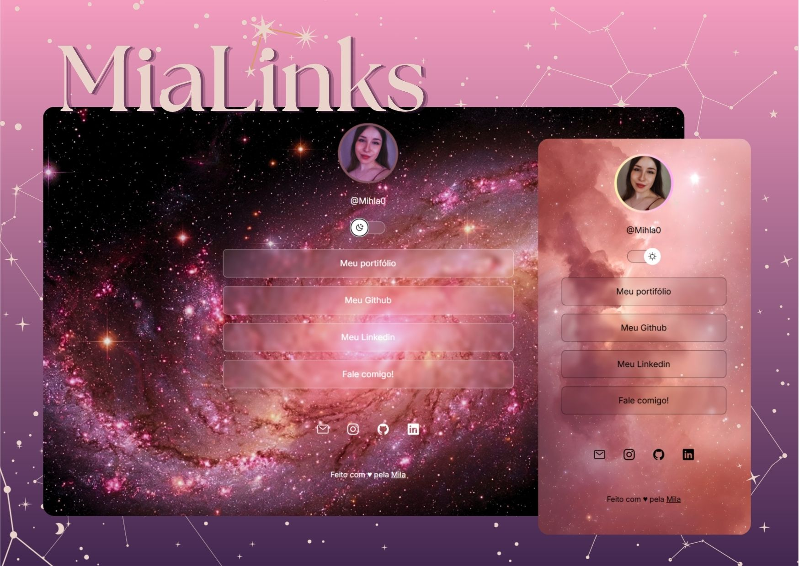

<h1 align="center"> MiaLinks </h1>

  Um agregador de links personalizado para organizar sua presença online e atuar como um cartão de visitas digital.

  <a href="#-tecnologias">Tecnologias</a>&nbsp;&nbsp;&nbsp;|&nbsp;&nbsp;&nbsp;
  <a href="#-projeto">Projeto</a>&nbsp;&nbsp;&nbsp;|&nbsp;&nbsp;&nbsp;
  <a href="#-layout">Layout</a>&nbsp;&nbsp;&nbsp;|&nbsp;&nbsp;&nbsp;
  <a href="#memo-licença">Licença</a>

  

 

  

## 🚀 Tecnologias

Este projeto foi construído utilizando as seguintes ferramentas e linguagens:

- **HTML5**: Estruturação semântica do conteúdo.
- **CSS3**: Estilização, incluindo uso de variáveis e media queries para responsividade.
- **JavaScript**: Lógica de interação para o switch de temas (Light/Dark mode).
- **Git & GitHub**: Controle de versão e hospedagem.
- **Figma**: Base de design e prototipagem.

## 💻 Projeto

O **MiaLinks** é uma aplicação prática de um cartão de visitas online, onde o usuário pode centralizar todos os seus links importantes (redes sociais, portfólio, contatos) em uma única interface limpa e adaptável a diferentes dispositivos.

> [!TIP]
> **[Acesse o projeto online aqui](https://milamehl.github.io/MiaLinks/)**

## 🔖 Layout

O design deste projeto seguiu um modelo disponível na comunidade do Figma. Você pode visualizar o layout original através [deste link](https://www.figma.com/community/file/1187422022288947321).

## :memo: Licença

Este projeto está sob a licença MIT. Veja o arquivo [LICENSE](LICENSE) para mais detalhes.

---

Desenvolvido por **Camila (Mila :P)**